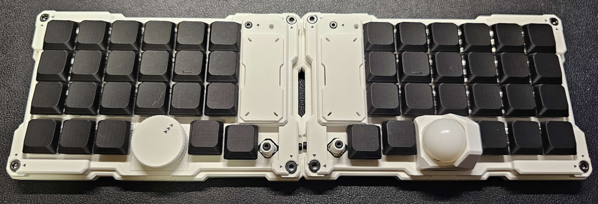

# MeKaBu 製品情報   

# 概要

共同開発プロジェクトにて開発した、6列オーソリニア配列を基軸とした、拡張モジュールによる機能拡張が可能な、無線分割式キーボードです。

<aside>
学名：Futhesia moduora (Collective Discovery, 2025)
通称：MeKaBu（メカブ）

</aside>

<aside>

左右に分かれた格子状の入力面を基軸としながらも、外部モジュール（通称：Node）によって自在に形を変える革新的な入力装置です。現実とデジタルの夢の間の境界に存在する、ある種の概念的生命体として振る舞います。

</aside>

# 特徴

分割界・第四層で発見された、複数の開発者が知識と経験を持ち寄ることで生まれた、知的・構造的進化を続ける集合知式入力装置です。

<aside>

**1.Cognitive Lattice (知の格子)**
機能美と論理が交錯するキーレイアウト設計

</aside>

<aside>

**2.Modular Nexus (拡張構造)**
ポインティングデバイス、エンコーダー、センサーなどを自由に組み換え可能なモジュール構造

</aside>

<aside>

**3.Resonant Evolution (共鳴型進化)**
開発者のコードやデザインが有機的に統合され、全体として進化する特性

</aside>

<aside>

**4.Tectonic Mode (テンティング適応)**
物理的な形状を柔軟に適応させることが可能なフォームファクター

</aside>

# スペック

| キー数 | 46キー (分割時：23キー × 2) |
| --- | --- |
| レイアウト | Ortholinear |
| スイッチ互換 | Choc V2 |
| ソケット | ホットスワップ対応 (Kailhソケット) |
| マウント方式 | インテグレーテッドマウント |
| ケース素材 | PLA (3DP FDM) |
| 中枢処理系 | Seeed Studio XIAO nRF52840 |
| ファームウェア | ZMK |
| 接続方式 | USB Type-C / ワイヤレス |
| 電源 | USB給電 / 内蔵バッテリー |
| サイズ(片側) | W約143mm × D約90mm × H約30mm (トラックボールモジュール装着時最大寸法) |
| 重さ(片側) | 約150g(左右組み立て済み、モジュール込み) |

# キット内容

## スタンダードキット

ロータリーエンコーダーとトラックボールモジュールを使用した組み立てが可能なキットです。

### 同梱品

- 左メイン基板 × 1
- 右メイン基板 × 1
- マイコン × 2
- モジュール接続ケーブル × 2
- ロータリーエンコーダーモジュール部品一式 × 1
- トラックボールモジュール部品一式 × 1
- 左ケース・部品一式 × 1
- 右ケース・部品一式 × 1

### 別途購入が必要な部品

- キースイッチ × 46（Choc v2）
- 1Uキーキャップ × 46（17mmピッチ用）
- キーソケット × 46（ロープロファイル用）
- LiPoバッテリー × 2（推奨：3.7V 300mAh、W約6.7mm × L約20.5mm × H約32mm）

### その他

- その他のキットについての詳細は、追ってご案内いたします。
- ダイオードは基板に実装されているため不要です。
- モジュールは左右共通ですが、動作にはファームウェアの書き換えが必要になります。
- 組み立てにはんだ付けの作業が必要です。

### 注意事項

Lipoバッテリーの使用・充電・保管・取り扱いにおいて発生したいかなる事故・損傷・火災・損害につきましても、当方では一切の責任を負いかねます。あらかじめご了承の上、ご自身の責任にてご使用ください。

1. **充電時に目を離さないで下さい。**
    
    過充電や過放電はバッテリーの発熱・膨張・発火の原因になります。
    
2. **高温・直射日光の当たる場所に放置しないでください。**
    
    高温環境下では劣化が早まり、発火の危険性が高まります。
    
3. **ショートさせないようご注意ください。**
    
    端子間の接触や破損によりショートが起こると、発煙・発火につながるおそれがあります。
    
4. **物理的に衝撃を与えたり、変形・穴あけをしないでください。**
    
    落下や圧迫による損傷は非常に危険です。
    
5. **充電中や使用中は、バッテリーの状態に注意を払ってください。**
    
    異常な発熱・膨張・異臭などを感じた場合は、ただちに使用を中止し、安全な場所に移動してください。
    
6. **長期間使用しない場合は、適切な電圧で保管してください。**
    
    満充電・過放電の状態で放置すると、劣化や破損の原因になります。
    
7. **お子様の手の届かない場所に保管してください。**
    
    誤操作や誤接触による事故を防ぐためです。
    
8. **火気や可燃物の近くでは絶対に使用・保管しないでください。**

# 拡張モジュール

- トラックボールモジュール
- ロータリーエンコーダー
- ロータリーエンコーダー付きアナログスティック
- 磁束測位型自由制御端末（開発中）

# 購入について

頒布に関するご案内は、Discordのサポートサーバーにて行なっています。

購入を希望される方は、以下のアンケートにご回答いただき、回答後に表示されるリンクよりDiscordのサポートサーバーへご参加ください。

<aside>

https://docs.google.com/forms/d/e/1FAIpQLSfnKiYQV-uX9vSbJ8JRe0ehNIJCu-9HIQmxHeYcHTToJGAMlA/viewform

</aside>

# お問合せ

ご不明な点や感想などございましたら、下記のDM（X）、Discordのサポートサーバーまでお気軽にお問い合わせください。

<aside>

DM：[@teporz](https://x.com/teporz)

</aside>

なお、お問い合わせ内容によっては、お時間をいただく場合がございます。
あらかじめご了承ください。
