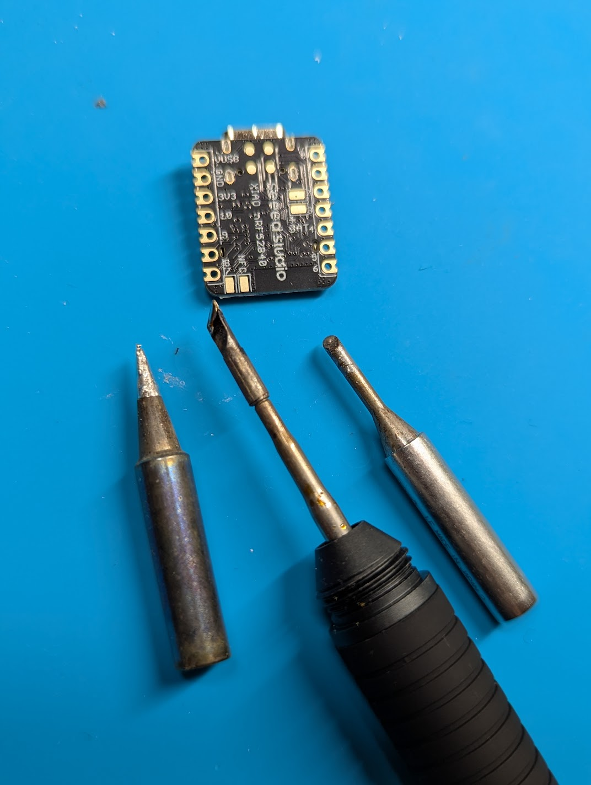
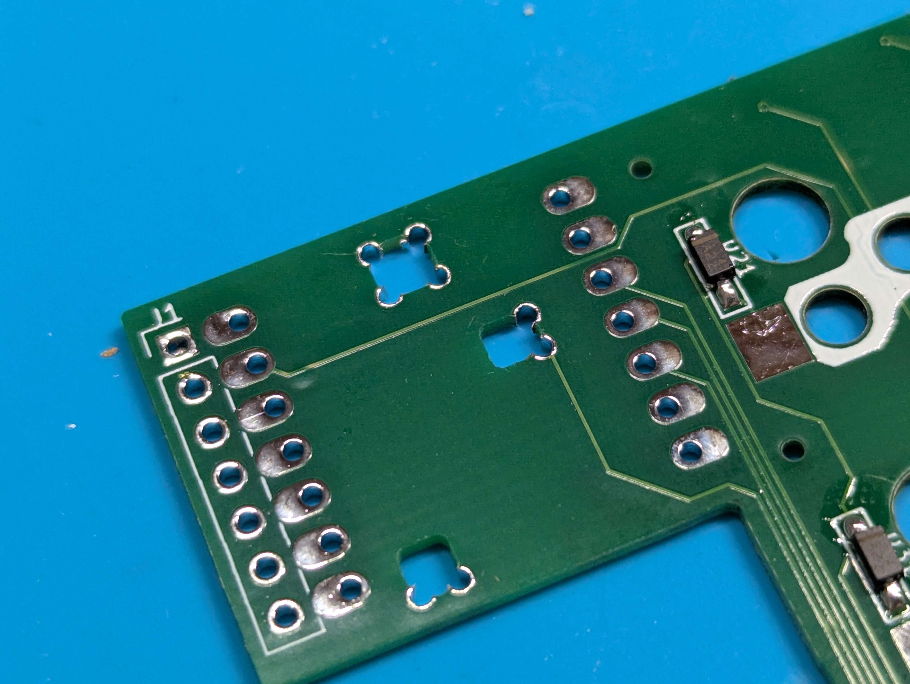
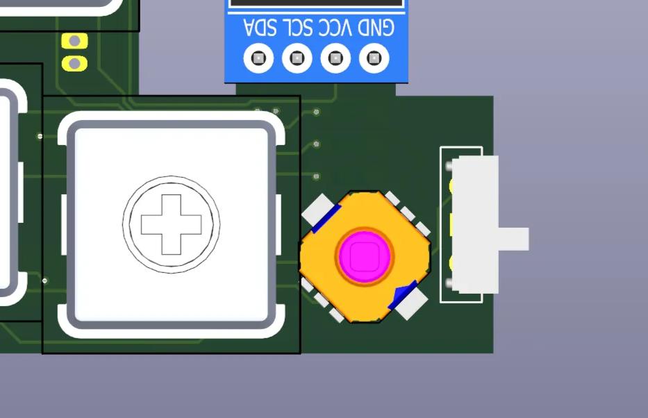
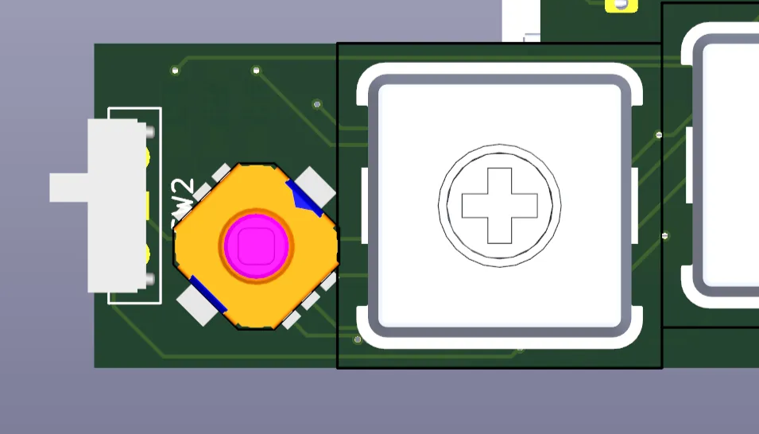
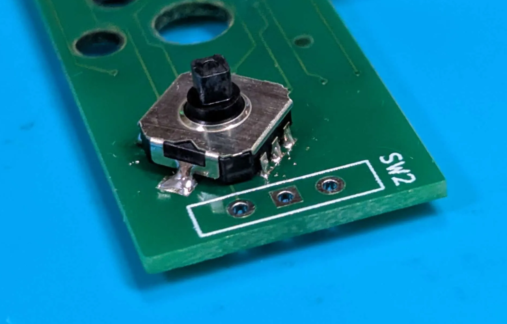
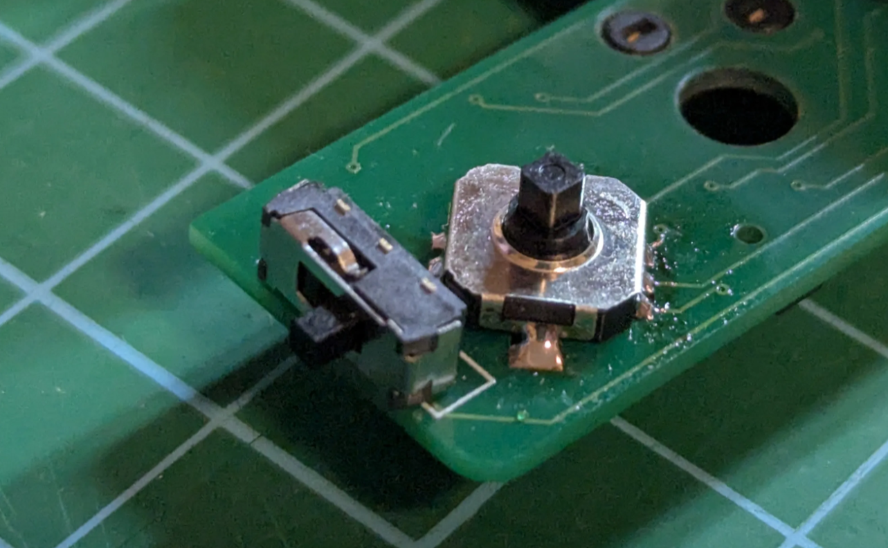
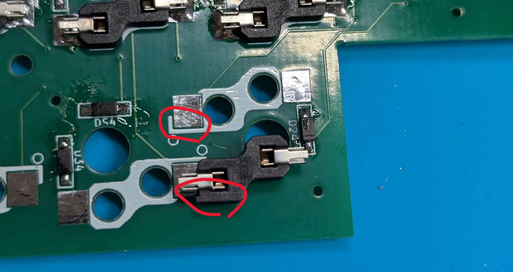

# 🎯 このガイドについて

MeKaBuの基板組み立て手順を解説します。
**完成予定時間：約2-3時間を想定しています**

記載はv0.3版のものです。今後内容は変更される可能性があります。

# 🛠️ 必要な工具・材料

## 必須工具

- [ ]  はんだごて（温度調整可能、推奨：270-320℃）

※細めのコテ先があると便利です

- [ ]  はんだ（0.6-0.8mm）
- [ ]  瞬間接着剤　※方向スイッチノブの取り付けに使用します

おすすめはこちら

[セメダイン 瞬間接着剤3000ゼリー状速硬化 P3g CA-154](https://amzn.to/49gb3zb)

## あると便利

- [ ]  フラックス
- [ ]  [精密ニッパー](https://amzn.to/3LAYxkx)
- [ ]  ピンセット（先が細いもの）
- [ ]  マスキングテープ
- [ ]  [はんだ吸い取り機](https://amzn.to/451EaUh)
- [ ]  はんだ吸い取り線（修正用）
- [ ]  テスター（動作確認用）
- [ ]  作業用ルーペ

# 📚 安全作業のポイント

- 換気の良い場所で作業
- はんだごての取り扱い注意
- 適切な休憩を取る
- 目を休める（1時間に10分程度）

# 📖 詳細手順

## 1. PCBの準備

### 🎯 目的

基板をきれいな状態にして、はんだ付けの品質を向上させる

### ⚠️ 重要な注意点

- **ぴろぴろ（スルーホール内の除去されていないメッキの破片）はなるべく除去**：ショートの原因になります
- **引きちぎり禁止**：ピンセットで引っ張るとメッキが剥がれる可能性があります

### 📝 手順

**ぴろぴろの確認**

ショートの原因になるので、3つの大きな穴のぴろぴろ（最大8つ）は先が細いニッパーやハサミで切り取るか内側に丸め込む
ピンセットで引きちぎるとメッキが剥がれることがあるので非推奨（一敗）

ブリッジの原因になるのですべてのスルーホールについて、除去できていることを確認すること

**安全な除去方法**

- ✅ 精密ニッパーで根元から切り取る
- ✅ 先の細いハサミで慎重にカット
- ✅ 内側に丸め込む

**仕上げ確認**

- ぴろぴろが隣の端子に接触しないようになっていること
    
    
    

### ✅ 完了チェック

- [ ]  全てのぴろぴろが除去されている

## 2. 方向スイッチの取り付け

### 🎯 目的

5方向入力（上下左右＋プッシュ）を可能にする重要なコンポーネントの取り付け

### ⚠️ 重要な注意点

- **左右で向きが異なる**：必ず向きを確認、一度取り付けると修正が困難です。（修理のご相談はDMください）
- **位置合わせが重要**：一度付けると修正困難

### 📝 手順詳細

### 🔄 基本手順（左右共通）

1. **切り欠き側の足1つだけをはんだ付け**
    - 仮止めの意味で、後で調整可能な状態にする
2. **位置確認**
    - 各端子とパッドが正確に合っているかチェック
    - ずれている場合：切り欠き側のはんだを再加熱して調整
3. **反対側の足をはんだ付け**
    - スイッチが固定されてから実施
4. **全端子のはんだ付け**
    - 上下左右プッシュの5つの端子を順番に処理

### 📍 左手側の取り付け、切り欠きは右下を向く

### 📍 右手側の取り付け、切り欠きは右上を向く

### ✅ 完了チェック

- [ ]  左手側：切り欠き右下向き
- [ ]  右手側：切り欠き右上向き
- [ ]  全端子がしっかりはんだ付けされている
- [ ]  スイッチが基板に密着している
- [ ]  5方向の動作確認（軽く押して反応チェック）

## 3. 電源スイッチの取り付け

### 🎯 目的

キーボードの電源ON/OFFを制御

### ⚠️ 重要な注意点

- **表裏を間違えない**：シルクのある側に取り付け
- **スイッチの向きに注意（スライド機構が基板外側に向いているか・基板に対して垂直か）**

### 📝 手順

1. **取り付け面の確認**
    - シルクスクリーン（白い印刷）がある面に取り付け

1. **はんだ付け**
    - スイッチを正しい向きで配置
    - 斜めに取りつかないようマスキングテープなどで仮止め推奨
    - 各端子を確実にはんだ付け

### ✅ 完了チェック

- [ ]  シルク面に正しく取り付け
- [ ]  スイッチが確実に固定されている
- [ ]  動作確認（クリック音とON/OFF動作）

## 4. マイコンの取り付け

### 🎯 目的

キーボードの頭脳となるマイクロコントローラーを実装

### ⚠️ 重要な注意点

- **最も難易度が高い作業**
- **はんだの盛りすぎ禁止**：ケースに干渉する
- **位置合わせが重要**：後で修正困難
- ⚠️⚠️⚠️**表裏を間違えないこと**⚠️⚠️⚠️

### 📝 手順

1. **位置合わせ**
    - 適当なピンヘッダでPCBとマイコンを位置合わせ
    - マスキングテープで仮固定（浮き防止）
2. **背面のはんだ付け箇所**
    - ✅ 中央のバッテリー端子
    - ✅ 下部のNFCパッド（背面）
    
    ※その他の端子ははんだ付け不要です。
    
    
    
3. **背面パッドのコツ**
    - フラックスをパッドに塗っておく
    - 十分な加熱時間を確保
4. **はんだ量の調整**
    - **目安**：パッドの面より少し盛り上がる程度
    - **盛りすぎた場合**：吸い取り機で除去

※マイコンのハンダの様子の例

### ✅ 完了チェック

- [ ]  マイコンが正しい位置に配置
- [ ]  バッテリー端子がはんだ付け完了
- [ ]  NFCパッドがはんだ付け完了
- [ ]  はんだの高さがケース干渉しないレベル
- [ ]  目視でショートがないことを確認

## 5. ソケットの取り付け

### 🎯 目的

キースイッチを取り付けるためのソケットを実装

### ⚠️ 重要な注意点

- **向きがある**：シルクの伸びている側 = 角ばっている部分

### 📝 手順

1. **向きの確認**
シルクが伸びている側が、角ばっている部分に対応
    
    
    
2. **はんだ付け**
    - ソケットを正しい向きで配置
    - 片側ずつ確実にはんだ付け
    - 全体の向きが揃っているか最終確認

### ✅ 完了チェック

- [ ]  全ソケットの向きが正しい
- [ ]  各ソケットがしっかり固定されている
- [ ]  はんだ量が適切（多すぎず少なすぎず）

## 6.バッテリーコネクタの取り付け

### 🎯 目的

バッテリーを接続するためのコネクタを実装

### ⚠️ 重要な注意点

**ショートさせないこと**：大変危険ですので細心の注意を払ってください

**バッテリー無しでも利用可能**：有線接続でも動作します。難しい場合はこの工程をスキップすることをお勧めします。

### 📝 手順

**1. 取り付け** 

- 向きに注意してスルーホールに奥まで挿入してハンダ付けする

バッテリーはケーブルに無理な力がかからないように収める。

### ✅ 完了チェック

- [ ]  スルーホールにしっかり挿入されている

## 7. モジュール接続ケーブルの取り付け

### 🎯 目的

モジュール基板を接続するためのケーブルを実装

### ⚠️ 重要な注意点

- **FPCケーブル、コネクタはナイーブです**：ケーブルに無理な力をかけたり、折り曲げたりするとショート、断裂する恐れがあります。

コネクタのラッチ（蓋）は壊れやすいため優しく扱うようにしてください。

ラッチ固定状態でケーブルを抜き差しすると、コネクタが絶対に壊れるのでやらないでください。

### 📝 手順

1. **ケーブルの準備**
    - ケーブルに傷がないこと、折り曲がってないことを確認
2. **取り付け**
    - コネクタのラッチを上げる
    - ケーブルを優しく、まっすぐ奥まで差し込む
    - 確実にコネクタに挿入されていることを確認して、ラッチを閉める

### ✅ 完了チェック

- [ ]  コネクタのラッチが閉まっていること
- [ ]  ケーブルが奥までまっすぐ差し込まれていること

## 9. オプション：OLED実装

### 🎯 目的

ディスプレイ機能の追加（オプション機能）

### 🔩必要なもの

- OLED（I2C 128x32 例：[https://www.amazon.co.jp/dp/B088FLH7DG](https://www.amazon.co.jp/dp/B088FLH7DG)）
- 細い銅線（ジュンフロン線など）

### 📝 手順

空中配線で頑張る💪

左手側

右手側

### ✅ 完了チェック

- [ ]  配線が正しく接続されている

## 🔧 トラブルシューティング

### よくある問題と解決方法

### はんだ付け不良

| 症状 | 原因 | 解決方法 |
| --- | --- | --- |
| はんだが乗らない | 酸化、フラックス不足 | 清拭後フラックス塗布 |
| ブリッジ発生 | はんだ量過多 | 吸い取り線で除去 |
| 接合不良 | 加熱不足 | 十分な加熱時間確保 |

### 部品の問題

| 症状 | 原因 | 解決方法 |
| --- | --- | --- |
| キーが反応しない | ダイオード向き間違い | 向きを確認して交換 |
| 方向スイッチ誤動作 | 切り欠き向き間違い | 正しい向きで交換 |
| 電源が入らない | スイッチ接触不良 | はんだ付け状態確認 |

---

**🎊 お疲れ様でした！素晴らしいキーボードの完成です！**