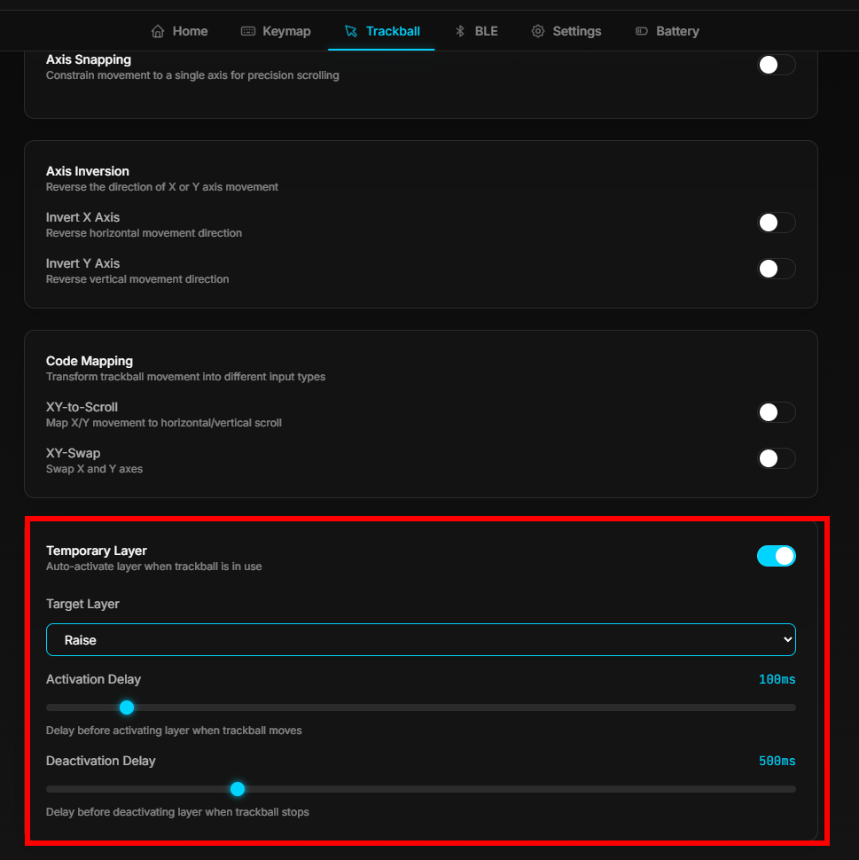

```jsx
                                                                                         
                                :-:                                                      
                               =@@@%=                                                    
                               .#@@@@%-                                                  
                                 =@@@@@=         :%%#:                                   
                    :*#*:         :@@@@@-        *@@@%                                   
                    +@@@@#.        +@@@@#        %@@@%                                   
                     =@@@@@-       -@@@@%       +@@@@*                                   
                      .#@@@@=      -@@@@%     .#@@@@%.                                   
                        #@@@@.     #@@@@=    =@@@@@%:                                    
                        :@@@@=    *@@@@*   -%@@@@@*                                      
                        :@@@@=   *@@@@#   +@@@@@*:   -#%#-                               
                        =@@@@.  =@@@@#   #@@@@#:    -@@@@%                               
                        *@@@#   %@@@@.  *@@@@=    .=@@@@@=                               
                        %@@@*   @@@@*  -@@@@-   :*%@@@@@=                                
                        #@@@#   #@@@=  #@@@=  .#@@@@@#+.                                 
                        =@@@@-  -@@@+  %@@*  :@@@@#=.                                    
         --.             +@@@@:  +@@%  #@@: :@@@#:                .--                    
       .%*=%*=======:     -%@@@=  *@@- *@@  %@@-      -==========*%+*%.                  
       :@*-%#++++++*@#.     -#@@#: #@# =@% +@%:     -%%++++++++++#@-+@:                  
        .==:        .*@+      :+@@= %@:-@*.@%.    .*@=            :==.                   
           .:         :#%=      .+@+-@*=@=#%.    +@*.            :.                      
         .%**%=-----:   -%#---:   +@*%%%@%@:  :=%#:   :--------=%**%:                    
         -@=-@#*****%#:   =***#%+*@@@@@@@@@%+#%*-   -%%********#@--@=                    
          :++-       +@#:      .+@@@@@@@@@@@*-    :#%=          -++-                     
                      .*@#*******%@@@@@@@@@@*****#@+                                     
                        .:::::::::::::::::::::::::.                                      
                                                                                         
```

[公式リポジトリ](https://github.com/Modulable-Keyboard-Developer/zmk-config-MKB)  →**Deprecated**

**最新版はこちら→[https://github.com/te9no/zmk-config-MKB2](https://github.com/te9no/zmk-config-MKB2)**

# ざっくり解説

./  
│  build.yaml・・・ビルドするファームウェアの定義  
│  
├─.github  
│  └─workflows  
│          build-nix.yml・・・nix版build.yml→⚠️Outdated  
│          build.yml・・・通常のbuild.yml  
│          draw-keymap.yml・・・キーマップ画像ファイル生成用  
│  
├─boards  
│  └─shields  
│      └─MKB  
│              Kconfig.defconfig・・・共通Kconfig定義  
│              Kconfig.shield・・・Shield定義  
│              MKB.dtsi・・・RCマクロ、physical layout定義、zmk-rgbled-widget設定、エンコーダ定義  
│              MKB.zmk.yml  
  
～以下左手～  
  
│              MKB_L_Base.conf・・・左手共通config  
│              MKB_L_Base.overlay・・・kscan、input-listerner、input-processor、OLED用設定  
│              MKB_L_ENC.conf・・・エンコーダモジュールconfig  
│              MKB_L_ENC.overlay・・・エンコーダモジュールdevice tree  
│              MKB_L_JOY.conf・・・アナログスティック＆エンコーダモジュールconfig  
│              MKB_L_JOY.overlay・・・アナログスティック＆エンコーダモジュールdevice tree  
│              MKB_L_KEY.conf・・・キーモジュールconfig  
│              MKB_L_KEY.overlay・・・キーモジュールdevice tree  
│              MKB_L_RZT.conf・・・ろくじたんモジュールconfig  
│              MKB_L_RZT.overlay・・・ろくじたんモジュールdevice tree  
│              MKB_L_TB.conf・・・トラックボールモジュールconfig  
│              MKB_L_TB.overlay・・・トラックボールモジュールdevice tree  
│              MKB_L_TPD.conf・・・トラックパッドモジュールconfig  
│              MKB_L_TPD.overlay・・・トラックパッドモジュールdevice tree  
│              MKB_pinctrl_L.dtsi・・・OLED用ピン配置設定  

～以下右手～  
│              MKB_pinctrl_R.dtsi  
│              MKB_R_Base.conf  
│              MKB_R_Base.overlay  
│              MKB_R_ENC.conf  
│              MKB_R_ENC.overlay  
│              MKB_R_JOY.conf  
│              MKB_R_JOY.overlay  
│              MKB_R_KEY.conf  
│              MKB_R_KEY.overlay  
│              MKB_R_RZT.conf  
│              MKB_R_RZT.overlay  
│              MKB_R_TB.conf  
│              MKB_R_TB.overlay 
│              MKB_R_TBv3.conf  ・・・（旧開発版）トラックボールモジュールconfig
│              MKB_R_TBv3.overlay  ・・・（旧開発版）トラックボールモジュールdevice tree  
│              MKB_R_TPD.conf  
│              MKB_R_TPD.overlay 
│  
├─config  
│      kle.json・・・kle用json  
│      MKB.json・・・keymap drawer用json  
**│      MKB.keymap・・・キーマップ**  
│      west.yml・・・module定義  
│  
├─snippets  ・・・snippet（overlayの一種）  
│  └─Default  ・・・snippet名  
│             Default.overlay  ・・・左手input-listener用overlay  
│             snippet.yml    ・・・左手input-listener用overlay用snippet定義  
│  
├─firmware・・・ファームウェア置き場  
│  ├─main・・・ブランチ名  
│  │  └─firmware  
│  │          MKB_L_MODULE_ENC.uf2  
│  │          MKB_L_MODULE_JOY.uf2  
│  │          MKB_L_MODULE_RZT.uf2  
│  │          MKB_L_MODULE_TB.uf2  
│  │          MKB_R_MODULE_ENC.uf2  
│  │          MKB_R_MODULE_JOY.uf2  
│  │          MKB_R_MODULE_RZT.uf2  
│  │          MKB_R_MODULE_TBv3.uf2    ・・・（旧開発版）右手トラックボールモジュール用⚠️通常は使用しません
│  │          MKB_R_MODULE_TBv4.uf2  
│  │          settings_reset-seeeduino_xiao_ble-zmk.uf2  
│  │・・・  
│  
├─keymap-drawer・・・キーマップ画像置き場  
│      config.yaml  
│      MKB.svg  
│      MKB.yaml  
│  
└─zephyr・・・だいじなやつ  
    module.yml  

# ファームウェアの書き込み方法

[https://zmk.dev/docs/user-setup#flashing-uf2-files](https://zmk.dev/docs/user-setup#flashing-uf2-files)

例：標準構成（左手エンコーダ、右手トラックボール）の場合  
→左手側に「MKB_L_MODULE_ENC.uf2」、右手側に「MKB_R_MODULE_TBv4.uf2」（⚠️MKB_R_MODULE_TBv3.uf2ではありません）を書き込む。  

例：左手アナログスティック、右手トラックボールの場合  
→左手側に「MKB_L_MODULE_JOY.uf2」、右手側に「MKB_R_MODULE_TBv4.uf2」を書き込む。  

例：左手トラックボール、右手トラックボールの場合  
→左手側に「MKB_L_MODULE_TB.uf2」、右手側に「MKB_R_MODULE_TBv4.uf2」を書き込む。  

# キーマップの更新方法

リポジトリをフォークして編集するか、[Keymap Editor](https://nickcoutsos.github.io/keymap-editor/)を使用してください。  
[ZMK Studio](https://zmk.studio//)や[DYA Studio](https://studio.dya.cormoran.works/)にも対応しています。  

# モジュールとファームウェアの交換方法

- 電源をOFFにする
- ボトムケースを外す
- モジュール側のFFPケーブルを外して取り外す
- 新しいモジュールにFFCケーブルを接続する
- ボトムケースを取り付ける
- PCと接続して、新しいモジュールに対応するファームウェアを書き込む

# FAQ

Q.AMLをONにする方法を教えていただけないでしょうか
DYA StudioでTemporary Layerを指定


Q.トラックパッドモジュールの上下を反転したい
https://github.com/te9no/zmk-config-MKB2/blob/main/snippets/Default/Default.overlay#L67-L72
```dsti
input-processors = <&zip_xy_transform (INPUT_TRANSFORM_XY_SWAP)>,
<&zip_xy_transform INPUT_TRANSFORM_Y_INVERT>, 
<&scroll_runtime_input_processor>;

scroller {
  layers = <5>;
  input-processors = <&zip_xy_transform (INPUT_TRANSFORM_XY_SWAP)>,
    <&zip_xy_transform INPUT_TRANSFORM_Y_INVERT>, 
    <&zip_xy_to_scroll_mapper>, 
    <&scroll_runtime_input_processor>;
};
```

左右も反転したいなら
```dsti
input-processors = <&zip_xy_transform (INPUT_TRANSFORM_XY_SWAP)>,
<&zip_xy_transform (INPUT_TRANSFORM_X_INVERT | INPUT_TRANSFORM_Y_INVERT)>, 
<&scroll_runtime_input_processor>;

scroller {
  layers = <5>;
  input-processors = <&zip_xy_transform (INPUT_TRANSFORM_XY_SWAP)>,
    <&zip_xy_transform (INPUT_TRANSFORM_X_INVERT | INPUT_TRANSFORM_Y_INVERT)>, 
    <&zip_xy_to_scroll_mapper>, 
    <&scroll_runtime_input_processor>;
};
```
