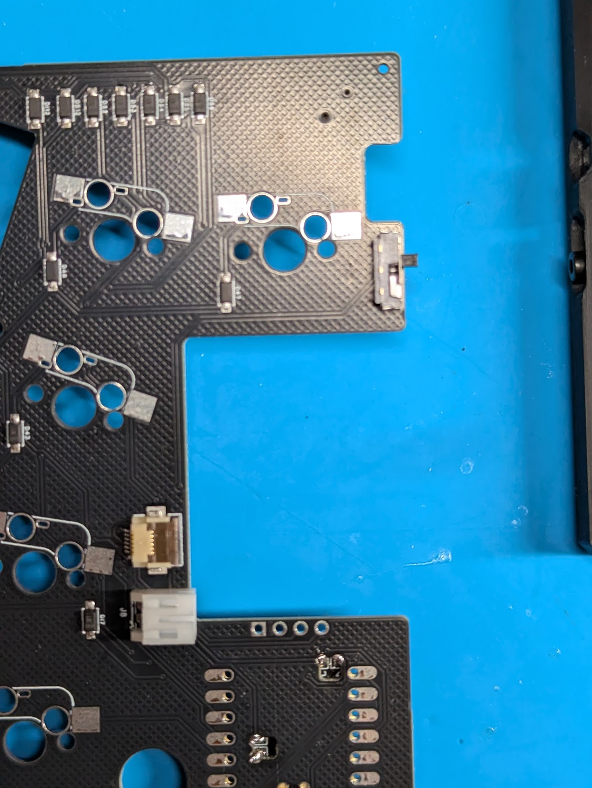
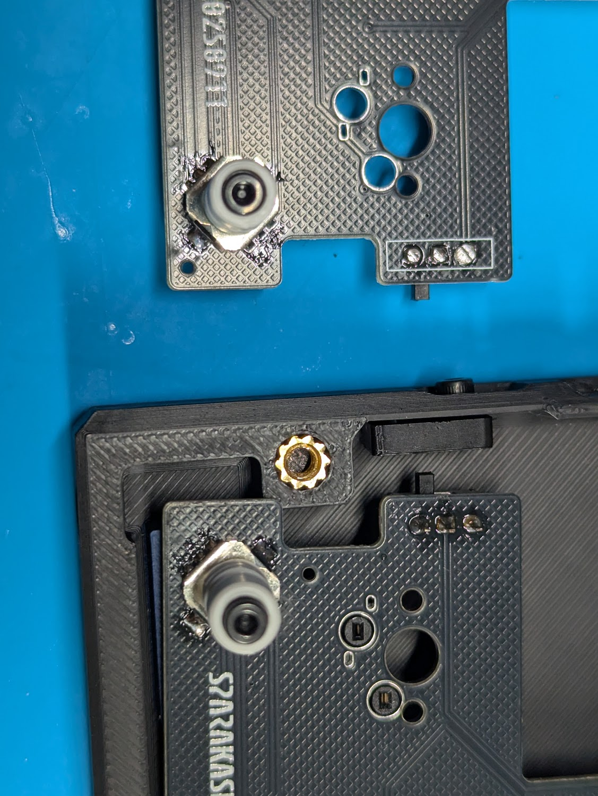
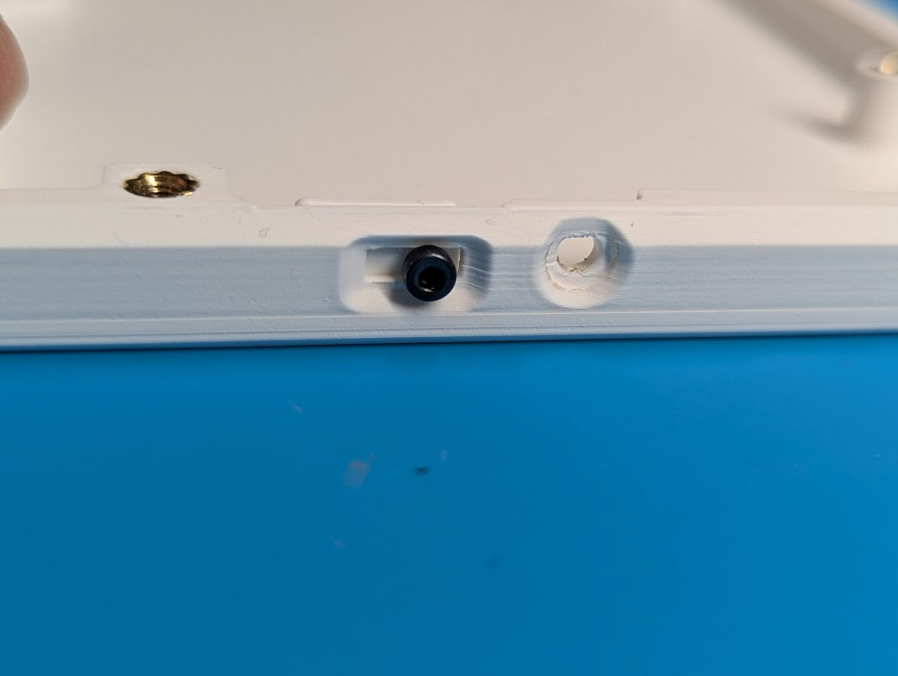
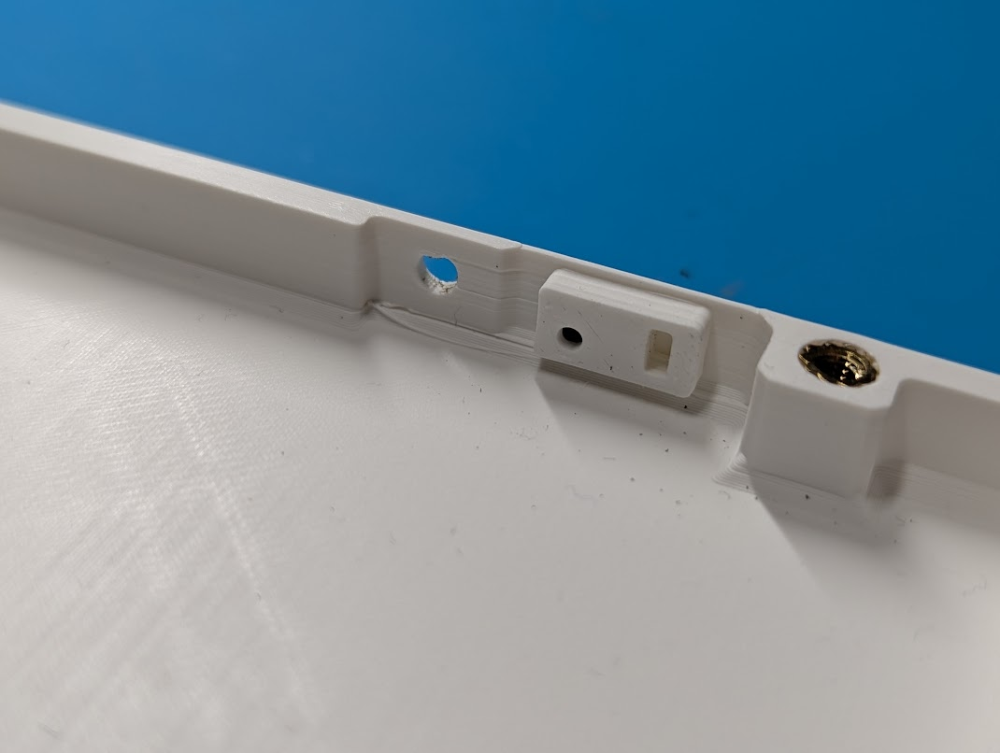
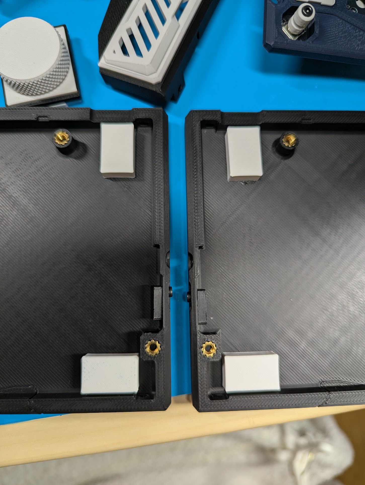
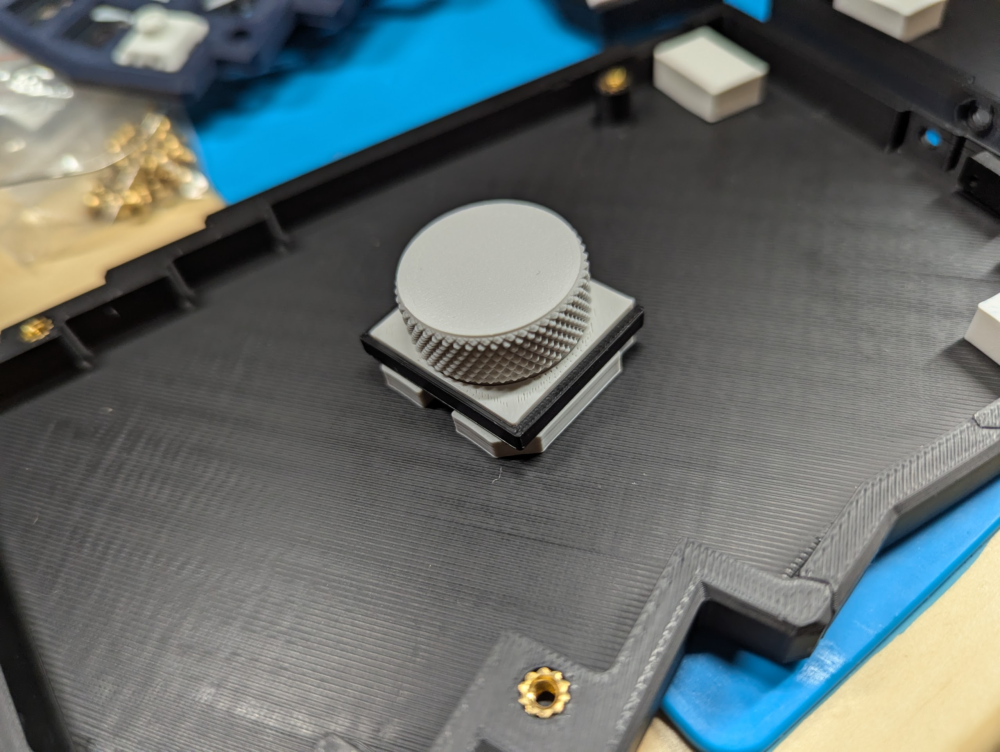
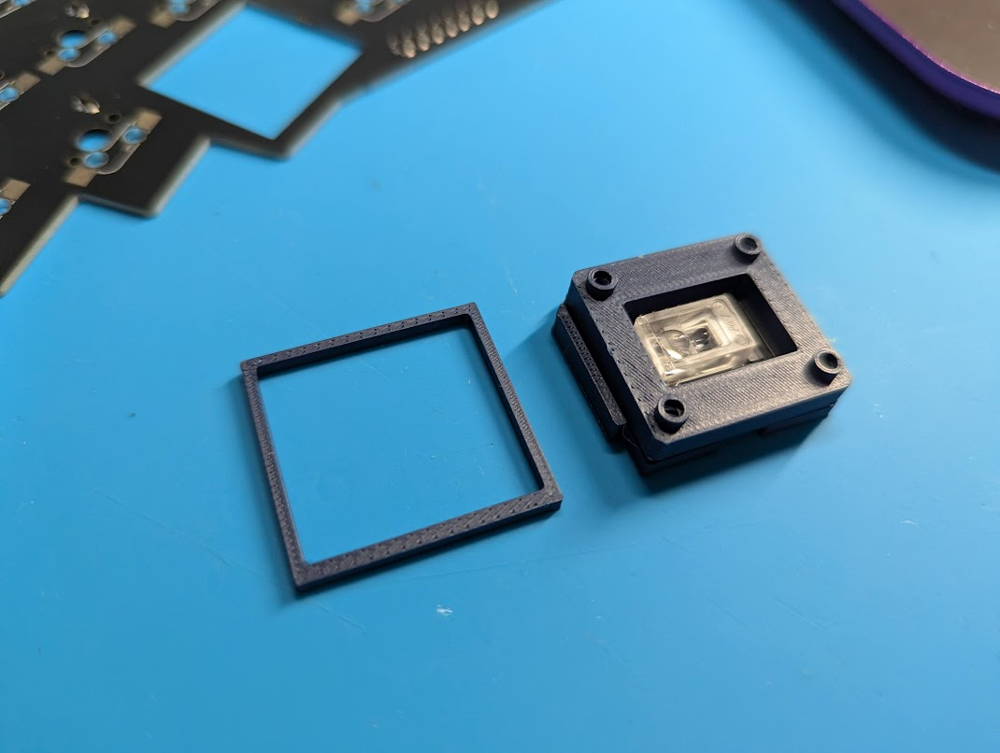
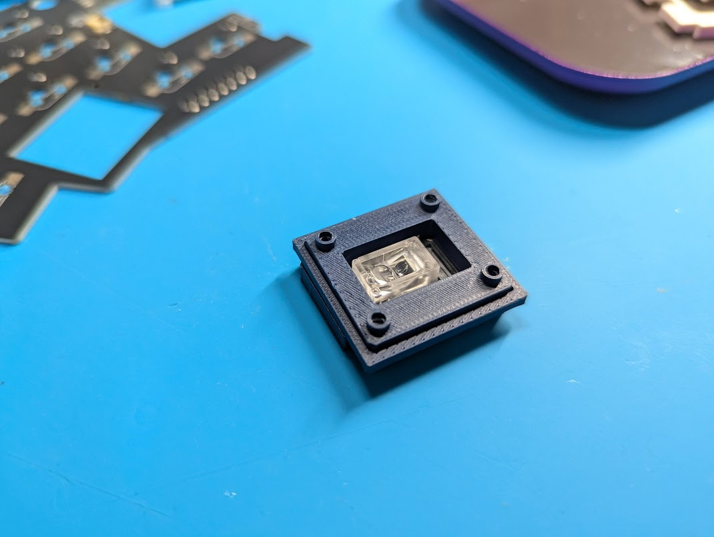
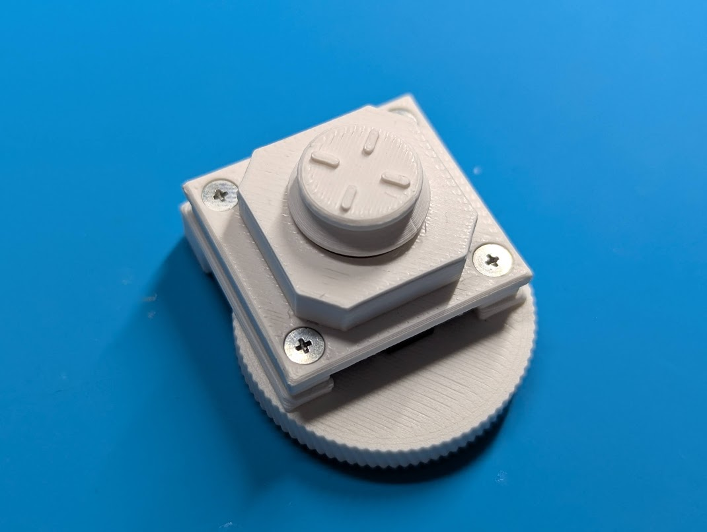
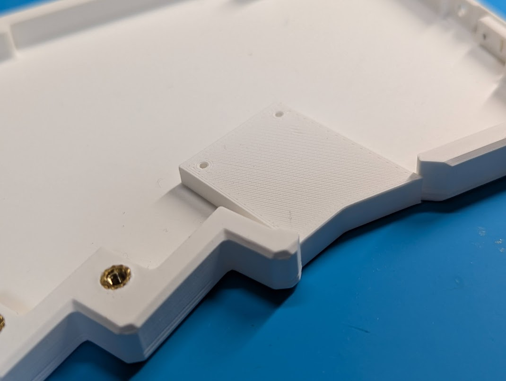

# SparAkasha部品表

SparAkasha専用の部品のみ記載

⚠️キースイッチ用ソケットは付属しません

[種類別部品一覧 ](%E7%A8%AE%E9%A1%9E%E5%88%A5%E9%83%A8%E5%93%81%E4%B8%80%E8%A6%A7%202dfdd0527735811bb92ed54c66ed18e1.csv)

# PCBの組立

## 組み立て方

MeKaBuと**ほぼ**一緒です

MXスイッチのみソケットに対応しています

Choc V2の方はソルダーしてください

電源スイッチはMeKaBuと取り付け面が逆です



方向スイッチはシルクの▲が切り欠きに対応します。



# ケースの組立

## インサートナットの挿入

左右5個ずつ良い感じに挿入する


## 電源スイッチアダプタの取り付け

上下の向きに注意して、ネジ穴が下によってる方が下側になるようにしてねじ止めする

※写真は左側ケース





## ケースカバーの組立

写真を参考にM3CAP、M2キャップ、リセットスイッチアダプタ、マイコンカバー、バッテリーカバー、透明棒を組み合わせる


## ケーススペーサの取り付け

ケーススペーサが付属している場合は以下の写真を参考に接着剤などで固定して下さい

⚠️ダイオードと干渉しないように注意



## ケースガスケットの取り付け

MXスイッチを使用する場合はケースガスケットをはめ込む

左右別なので注意、上部にケースとかみ合う突起があります

※写真の空中配線は気にしないでください


## ボトムとトップケースの組立

電源スイッチアダプタに電源スイッチノブが差し込まれるように載せる

差し込まれないまま、無理に組み合わせると折れるので注意

差し込まれにくいときは電源スイッチを左右に動かすと差し込まれます


## ケースねじ止め

M3xを使用してねじ止めする


# モジュールの組立

## エンコーダモジュール

MeKaBuと一緒

ガスケットを装着する



## トラックボールモジュール

ボトムハウジングとトップハウジングはMeKaBuと共通

ガスケットを装着する





M2タップとマグネットをMeKaBu同様に取り付けたら組付けられます


## アナログスティック＆エンコーダモジュール

これを


こうして


こう



薄型エンコーダノブと軸は接着剤で固定してほうがいいかもしれません

向きはこうです


MXスイッチを使用する場合はボトムケースに上げ底アダプタをはめ込む



# ファームウェアについて

ファームウェアはMeKaBuと共通になります。

キーボード名を変えたい場合は以下ファイルを修正してください。

/boards/shields/MKB/Kconfig.defconfig

```
#before
config ZMK_KEYBOARD_NAME
    default "MeKaBu"

```

```
#after
config ZMK_KEYBOARD_NAME
    default "SparaAkasha"

```