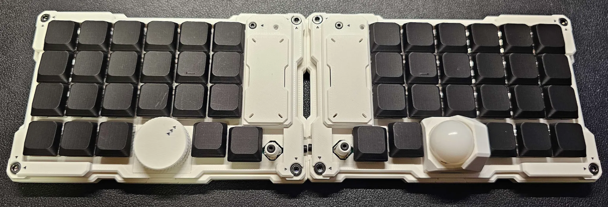

<link rel="stylesheet" href="style.css">

# 🧠 MeKaBu ― Collective Modular Keyboard

> **学名：** *Futhesia moduora* (Collective Discovery, 2025)  
> **通称：** MeKaBu（メカブ）

---

## 🌌 概要

共同開発プロジェクトにて開発中の、6列オーソリニア配列を基軸とした、拡張モジュールによる機能拡張が可能な、無線分割式キーボードです。  
左右に分かれた格子状の入力面を基軸としながらも、外部モジュール（通称：**Node**）によって自在に形を変える革新的な入力装置です。  
現実とデジタルの夢の間の境界に存在する、ある種の**概念的生命体**として振る舞います。

---

## ⚙️ 特徴

> 分割界・第四層で発見された、複数の開発者が知識と経験を持ち寄ることで生まれた、知的・構造的進化を続ける集合知式入力装置です。

### **1. Cognitive Lattice（知の格子）**
機能美と論理が交錯するキーレイアウト設計。

### **2. Modular Nexus（拡張構造）**
ポインティングデバイス、エンコーダー、センサーなどを自由に組み換え可能なモジュール構造。

### **3. Resonant Evolution（共鳴型進化）**
開発者のコードやデザインが有機的に統合され、全体として進化する特性。

### **4. Tectonic Mode（テンティング適応）**
物理的な形状を柔軟に適応させることが可能なフォームファクター。

---

## 📊 スペック

| 項目 | 内容 |
|------|------|
| キー数 | 46キー（分割時：23キー × 2） |
| レイアウト | Ortholinear |
| スイッチ互換 | Choc V2 |
| ソケット | ホットスワップ対応（Kailhソケット） |
| マウント方式 | インテグレーテッドマウント |
| ケース素材 | PLA（3DP FDM） |
| 中枢処理系 | Seeed Studio XIAO nRF52840 |
| ファームウェア | ZMK |
| 接続方式 | USB Type-C / ワイヤレス |
| 電源 | USB給電 / 内蔵バッテリー |
| サイズ（片側） | 約 W143 × D90 × H30 mm（トラックボール装着時） |
| 重さ（片側） | 約150g（モジュール込み） |

---

## 🧩 キット内容

### スタンダードキット
ロータリーエンコーダーとトラックボールモジュールを使用した組み立てが可能なキットです。

#### 同梱品
- 左メイン基板 × 1  
- 右メイン基板 × 1  
- マイコン × 2  
- モジュール接続ケーブル × 2  
- ロータリーエンコーダーモジュール部品一式 × 1  
- トラックボールモジュール部品一式 × 1  
- 左右ケース・部品一式 × 各1  

#### 別途購入が必要な部品
- キースイッチ × 46（Choc v2）  
- 1Uキーキャップ × 46（17mmピッチ用）  
- キーソケット × 46（ロープロファイル用）  
- LiPoバッテリー × 2（推奨：3.7V 300mAh、W6.7 × L20.5 × H32mm）

#### その他
- ダイオードは基板実装済み。  
- モジュールは左右共通（ファームウェア書き換えが必要）。  
- 組み立てにははんだ付けが必要です。

---

## ⚠️ LiPoバッテリーに関する注意

LiPoバッテリーの使用・充電・保管・取り扱いにおいて発生したいかなる事故・損傷・火災・損害につきましても、当方では一切の責任を負いかねます。ご自身の責任で安全に取り扱ってください。

1. 充電時に目を離さないでください。  
2. 高温・直射日光の当たる場所に放置しないでください。  
3. 端子間をショートさせないよう注意してください。  
4. 変形・穴あけ・衝撃を与えないでください。  
5. 異常な発熱・膨張・異臭を感じた場合は即停止。  
6. 長期保管時は適正電圧で保管してください。  
7. お子様の手の届かない場所に保管してください。  
8. 火気・可燃物の近くでは使用しないでください。

---

## 🔌 拡張モジュール

- トラックボールモジュール  
- ロータリーエンコーダー  
- エンコーダー付きスティック  
- 六軸磁束測位型自由制御端末（開発中）

---

## 🧱 ビルドガイド

👉 [MeKaBuビルドガイド（Notion）](https://www.notion.so/MeKaBu-21eee4efb9e7802e9e7acddccac24afa?pvs=21)

---

## 📜 プロジェクト活動記録

> [MeKaBu Project：活動記録（note）](https://note.com/akasha_min/m/m501d50e9595f)

---

## 🛒 購入について

頒布情報はDiscordのサポートサーバーでお知らせしています。  
購入希望者は以下のアンケートにご回答ください。

👉 [購入希望アンケートフォーム](https://docs.google.com/forms/d/e/1FAIpQLSfnKiYQV-uX9vSbJ8JRe0ehNIJCu-9HIQmxHeYcHTToJGAMlA/viewform)

---

## ✉️ お問い合わせ

ご不明な点・感想などは以下へお気軽に。

📧 **fm.mekabu@gmail.com**  
🐦 [**@Murasaki_min** on X](https://x.com/Murasaki_min)

---

© 2025 MeKaBu Project
